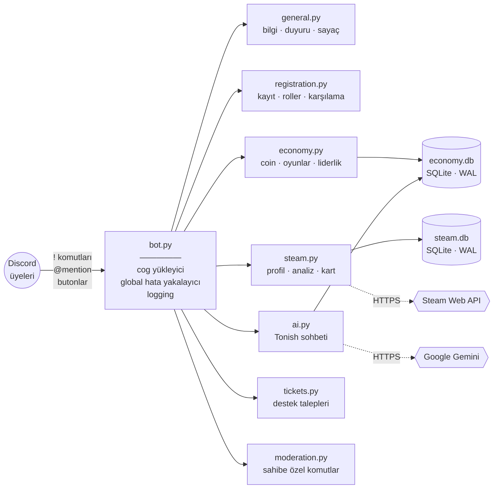

<div align="center">

# TonishBot

**nishdot Discord sunucusunun her işi yapan maskotu.**

Kayıt sisteminden sanal ekonomiye, Steam analizlerinden yapay zekâ sohbetine kadar
bir üniversite oyun geliştirme kulübünün ihtiyaç duyduğu her şey tek bir botta.

[](https://www.python.org/)
[](https://discordpy.readthedocs.io/)
[](https://ai.google.dev/)
[](https://www.sqlite.org/)
[](https://python-pillow.org/)
[](DEPLOYMENT.md)


`7 eklenti` · `43 komut` · `~3.700 satır Python` · `4 kalıcı arayüz`

</div>

---

## İçindekiler

- [Neler yapıyor?](#neler-yapıyor)
- [Mimari](#mimari)
- [Komutlar](#komutlar)
- [Kurulum](#kurulum)
- [Yapılandırma](#yapılandırma)
- [Sunucuya kurulum](#sunucuya-kurulum)
- [Mühendislik notları](#mühendislik-notları)
- [Proje yapısı](#proje-yapısı)
- [Güvenlik](#güvenlik)
- [Müzik hakkında](#müzik-hakkında)

---

## Neler yapıyor?

###  Kayıt ve karşılama
Yeni üye sunucuya girdiğinde tek butonla açılan bir form dolduruyor; isim, soyisim ve
nickname bilgisi `İsim 'Nick' Soyisim` biçiminde takma ada dönüşüyor — Discord'un 32
karakter sınırına takılırsa kademeli olarak kısaltılıyor. Ardından `Kayıtsız` rolü alınıp
`Topluluk` rolü veriliyor ve karşılama kanalına, üyenin avatarını içeren kişiye özel bir
görsel düşüyor. Kendini ifade eden roller (Developer, Artist, Level Designer, Storyteller,
UI/UX, Sound Artist, Playtester, Mentor…) kalıcı bir seçim menüsünden alınıyor.

###  TonishCoin ekonomisi ve oyunlar
Sunucuya özel sanal para birimi etrafında kurulu bir oyun ekosistemi: **Blackjack**
(gerçek buton arayüzüyle), **slot makinesi**, tur tabanlı **zindan savaşı**, 5 haneli
kod kırma oyunu **Sistem Kırıcı** ve emoji bilmeceleri. Günlük coin, admin bakiye
müdahalesi ve Pillow ile çizilen görsel liderlik tablosu da işin içinde.

> Bahisli oyunlarda bahis **oyun başlarken** düşülür ve bir kullanıcı aynı anda yalnızca
> tek oyun açabilir — bkz. [Mühendislik notları](#mühendislik-notları).

###  Steam entegrasyonu
Üyeler Steam hesabını bağladıktan sonra bot; son iki haftanın oynanma sürelerini
sıralıyor, iki kişinin ortak kütüphanesinden rastgele oyun öneriyor, o an kimin ne
oynadığını listeliyor, kütüphaneyi türlere göre analiz edip **Gamer DNA** çıkarıyor ve
üyeye özel görsel bir **Gamer Kart** basıyor. Sunucunun kolektif istatistikleri de
tek komutla geliyor.

###  Tonish - yapay zekâ asistanı
Google Gemini üzerine kurulu, kulübün kimliğine göre şekillendirilmiş bir sohbet
kişiliği. Etiketlenerek veya `!sor` ile konuşuluyor; sohbet geçmişi kullanıcı bazında
veritabanında saklanıyor ve otomatik kırpılıyor. Ayrıca sevdiğin oyuna benzeyen indie
yapımları tasarım terimleriyle açıklayan bir öneri motoru var.

###  Destek talepleri
Butonla açılan özel ticket kanalları. Kanal yalnızca açan kişiye ve moderatörlere
görünüyor, kapatma yetkisi de bu iki tarafla sınırlı.

###  Yönetim
Duyuru yayınlama, geri sayımlı etkinlik duyurusu ve bot sahibine özel moderasyon
komutları (ban, kick, timeout, rol, toplu mesaj silme).

---

## Mimari



Her özellik alanı bağımsız bir **cog**; `bot.py` yalnızca yükleme, hata yakalama ve
loglamadan sorumlu. Bir cog patlarsa diğerleri ayakta kalır ve hata log'a düşer.

---

## Komutlar

Prefix: `!`

###  Genel

| Komut | Açıklama |
|---|---|
| `!yardim` | Komut listesi - `!help`, `!komutlar`, `!yardım` |
| `!bilgi` | Kulüp hakkında bilgi |
| `!link` | Sosyal medya ve üyelik linkleri |
| `!yk` | Yönetim kurulu listesi |
| `!oyun` · `!ekonomi` · `!steam` | İlgili sistemin nasıl çalıştığını anlatan rehberler |
| `!oyunfikri` | Rastgele oyun fikri üretir: tür + tema + kısıtlama - `!gameidea` |

###  Ekonomi ve oyunlar

| Komut | Açıklama |
|---|---|
| `!bakiye [@kişi]` | Bakiye gösterir - `!tonishcoin`, `!cuzdan` |
| `!gunluk` | 24 saatte bir 50 coin |
| `!liderlik` | En zengin 5 kişinin görsel tablosu - `!top`, `!zenginler`, `!leaderboard` |
| `!blackjack <bahis>` | Buton arayüzlü Blackjack - `!bj` |
| `!slot <bahis>` | Slot makinesi |
| `!zindan` | Tur tabanlı zindan savaşı, giriş 50 coin - `!dungeon`, `!rpg` |
| `!sistemkirici` | 5 haneli kod kırma oyunu, giriş 100 coin - `!hacker`, `!hardcore` |
| `!tahmin <5 hane>` | Sistem Kırıcı tahmini |
| `!vazgec` | Sistem Kırıcı görevinden çıkar - `!birak`, `!iptal` |
| `!bilmece` | Emoji bilmecesi, 5 dakikada bir |

###  Steam

| Komut | Açıklama |
|---|---|
| `!steam_bagla <ID/link>` | Steam hesabını bağlar |
| `!oyunsuresi` | Son 2 haftanın oynanma süreleri sıralaması |
| `!ortak @kişi` | Ortak kütüphaneden rastgele öneri |
| `!kimoyunda` | Şu an kim ne oynuyor |
| `!kart [@kişi]` | Görsel Gamer Kart - `!kimlik` |
| `!analiz [@kişi]` | Gamer DNA tür grafiği |
| `!sunucu-istatistik` | Sunucunun kolektif istatistikleri - `!server-stats` |

> Steam profilinde **Oyun Detayları** ve **Envanter** herkese açık olmalı, yoksa API
> boş veri döner.

###  Yapay zekâ

| Komut | Açıklama |
|---|---|
| `@Tonish <mesaj>` | Botu etiketleyerek sohbet |
| `!sor <soru>` | Doğrudan soru |
| `!benzeroner <oyun>` | Benzer oyun önerisi - `!oner`, `!tavsiye` |
| `!sohbetisifirla` | Kendi sohbet geçmişini siler |

###  Yönetim

| Komut | Yetki | Açıklama |
|---|---|---|
| `!duyuru <mesaj>` | Admin | Duyuru kanalına embed duyuru |
| `!etkinliksayaci "gg.aa.yyyy" "SS:DD" "Başlık" Açıklama` | Admin | Geri sayımlı etkinlik duyurusu |
| `!kayital` · `!kayittest` | Admin | Kayıt butonunu yayınlar |
| `!rolmenusu` · `!rolbilgi` | Admin | Rol seçim menüsünü yayınlar |
| `!ticketkur` | Admin | Ticket panelini kurar |
| `!bakiyeguncelle @kişi <miktar>` | Admin | Bakiye ekler / çıkarır |
| `!ai-ban @kişi [sebep]` | Admin | AI kurallarını ihlal edeni yasaklar |

> `!duyuru` ve `!etkinliksayaci` yalnızca `ADMIN_COMMAND_CHANNEL_ID` kanalında çalışır.
> Süre biçimi: `10m`, `2h`, `1d` (saniye / dakika / saat / gün).

---

## Kurulum

**Gereksinim:** Python 3.10+

```bash
git clone https://github.com/Omercekadam/tonishbot.git
cd tonishbot
python3 -m venv venv
source venv/bin/activate        # Windows: venv\Scripts\activate
pip install -r requirements.txt
```

`.env` dosyasını örnekten oluştur ve doldur:

```bash
cp .env.example .env
```

Çalıştır:

```bash
python bot.py
```

> [!WARNING]
> `.env` dosyasını **asla** commit etme. Token, API anahtarı ve benzeri sırları hiçbir
> kod veya doküman dosyasına yazma — `.gitignore` bunları zaten dışlıyor ama son
> sorumluluk sende.

---

## Yapılandırma

Tüm ayarlar `.env` üzerinden okunur. Tam liste `.env.example` içinde:

| Değişken | Zorunlu | Açıklama |
|---|:---:|---|
| `DISCORD_TOKEN` | ✅ | Bot token'ı |
| `CEK_DISCORD_ID` | ✅ | Bot sahibinin Discord ID'si — `!cek*` komutlarının sahibi |
| `GEMINI_API_KEY` | — | Boşsa AI komutları kendini devre dışı bırakır |
| `STEAM_API_KEY` | — | Boşsa Steam komutları kendini devre dışı bırakır |
| `KAYIT_KANALI_ID` | ✅ | Kayıt butonunun bulunduğu kanal |
| `WELCOME_CHANNEL_ID` | ✅ | Karşılama görselinin gönderileceği kanal |
| `ADMIN_COMMAND_CHANNEL_ID` | ✅ | Yönetim komutlarının çalışabileceği kanal |
| `ANNOUNCEMENT_CHANNEL_ID` | ✅ | Duyuru kanalı |
| `EVENT_COUNTER_CHANNEL_ID` | ✅ | Etkinlik sayacı kanalı |
| `TOPLULUK_ROLU_ID` | ✅ | Kayıt sonrası verilen rol |
| `KAYITSIZ_ROLE_ID` | ✅ | Kayıt sonrası alınan rol |
| `MODERATOR_ROLU_ID` | ✅ | Ticket kapatma yetkisi olan rol |
| `TICKET_CATEGORY_ID` | ✅ | Ticket kanallarının açılacağı kategori |

**Gerekli Gateway Intent'leri:** `SERVER MEMBERS` ve `MESSAGE CONTENT` — ikisi de
[Discord Developer Portal](https://discord.com/developers/applications)'dan açılmalı.

Rol seçim menüsündeki roller `cogs/registration.py` içindeki `ROLE_OPTIONS` sözlüğünde
tanımlı; ID, etiket, emoji ve açıklama birlikte durur.

---

## Sunucuya kurulum

Üretim kurulumu (adanmış sistem kullanıcısı, systemd servisi, güvenlik sıkılaştırma,
bellek limitleri, log yönetimi, yedekleme) için ayrı bir rehber var:

**➡️ [DEPLOYMENT.md](DEPLOYMENT.md)**

Bot **hiçbir port dinlemez** — tüm trafiği dışa doğru websocket ve HTTPS'tir. Bu yüzden
web sunucusu barındıran bir VDS'e çakışmadan kurulabilir.

---

## Mühendislik notları

Kod tabanı baştan sona bir güvenlik ve dayanıklılık denetiminden geçirildi. Öne çıkan
kararlar:

<details>
<summary><b>💰 Bakiye işlemleri tek atomik SQL ile yapılır</b></summary>

<br>

"Önce oku, sonra kontrol et, sonra yaz" deseni bir yarış koşuludur: iki komut aynı anda
çalıştığında ikisi de aynı bakiyeyi okur ve kullanıcı sahip olmadığı parayı harcayabilir.
Coin harcayan her işlem bunun yerine tek bir atomik `UPDATE` üzerinden gider:

```python
async def try_spend(self, user_id, amount) -> bool:
    cursor = await db.execute(
        "UPDATE economy SET balance = balance - ? WHERE user_id = ? AND balance >= ?",
        (amount, user_id, amount),
    )
    return cursor.rowcount > 0     # False → yetersiz bakiye, hiçbir şey değişmedi
```

SQLite tek `UPDATE` ifadesini atomik yürütür; bakiye kontrolü ve düşme işlemi arasında
başka bir sorgu araya giremez. Eksi bakiye de bu sayede yapısal olarak imkânsız.

</details>

<details>
<summary><b>🎲 Bahis oyun başında düşülür, aynı anda tek oyun</b></summary>

<br>

Bahis oyunun sonunda tahsil edilirse, kötü bir el alan oyuncu hiçbir butona basmadan
zaman aşımına düşerek bedavaya kaçabilir. Bunun yerine bahis oyun başlarken `try_spend`
ile emanete alınır; kazanç, beraberlik ve kayıp senaryolarının hepsi bu emanet üzerinden
ödenir.

Ayrıca cog seviyesinde bir `active_games` kümesi tutulur ve `try/finally` ile temizlenir —
bir kullanıcı aynı anda birden fazla bahisli oyun açamaz.

</details>

<details>
<summary><b>🔘 Butonlar bot yeniden başlasa da çalışır</b></summary>

<br>

Discord'da bir arayüz bileşeni, botun belleğindeki `View` nesnesine bağlıdır — bot
yeniden başladığında eski mesajlardaki butonlar "This interaction failed" verir. Kayıt
butonu, rol menüsü ve ticket butonları `timeout=None` + sabit `custom_id` ile tanımlanıp
`cog_load` içinde `bot.add_view()` ile yeniden kaydedilir. Toplam 4 kalıcı arayüz, restart
sonrası ilk saniyeden itibaren çalışır durumdadır.

Kalıcı view'lar **paylaşılan tekil nesnelerdir**, bu yüzden hiçbir zaman yerinde
değiştirilmez; devre dışı görünüm gerektiğinde o mesaja özel yeni bir view üretilir.

</details>

<details>
<summary><b>⚡ Ağır işler event loop'u bloklamaz</b></summary>

<br>

Liderlik tablosu, karşılama görseli ve Gamer Kart Pillow ile çizilir — bu senkron ve
CPU-yoğun bir iştir. Tek bir event loop üzerinde çalışan bir bot için bu, görsel
üretilirken **tüm sunucuya yanıt verememek** demektir. Bütün Pillow işleri
`run_in_executor` ile ayrı bir thread'e taşınır; ağ istekleri ile çizim mantığı da
birbirinden ayrılmıştır.

</details>

<details>
<summary><b>🗄️ Veritabanı eşzamanlılığa hazırlanır</b></summary>

<br>

Her cog açılışta `PRAGMA journal_mode=WAL` uygular ve bağlantılarda 30 saniyelik
kilit bekleme süresi tanımlar. WAL modu okuyucuların yazıcıyı bloklamamasını sağlar;
ikisi birlikte yoğun anlarda gelen `database is locked` hatalarını ortadan kaldırır.

</details>

<details>
<summary><b>🧯 Hiçbir hata sessizce kaybolmaz — ve hiçbir istisna kullanıcıya sızmaz</b></summary>

<br>

`bot.py` içindeki global `on_command_error`; eksik argüman, hatalı tip, yetersiz yetki,
bekleme süresi ve DM kısıtı gibi durumların her birine anlaşılır bir Türkçe yanıt döner
(eksik argümanda doğru kullanımı da gösterir).

Beklenmedik hatalarda ise **tam traceback log'a yazılır, kullanıcıya yalnızca sabit bir
mesaj gider**. Bu bilinçli bir güvenlik kararı: SDK istisna metinleri zaman zaman istek
URL'ini ve dolayısıyla API anahtarını içerir.

</details>

<details>
<summary><b>🔕 Etiket taşması varsayılan olarak kapalı</b></summary>

<br>

Bot `allowed_mentions=AllowedMentions(everyone=False, roles=False)` ile başlatılır.
Bir kullanıcı girdisi bota `@everyone` yazdırmayı başarsa bile Discord bunu ping'e
çevirmez. Kasıtlı ping atan tek komut `!duyuru`, kendi izinlerini açıkça belirtir.

</details>

<details>
<summary><b>🔄 Durum bellekte değil veritabanında tutulur</b></summary>

<br>

`commands.cooldown` bellekte çalışır — bot yeniden başladığında sıfırlanır. Günlük coin
gibi gerçekten kalıcı olması gereken bir sınır için bu bir istismar yoludur; `!gunluk`
son kullanım zamanını `economy` tablosunda saklar ve restart'tan etkilenmez. Terk edilen
oyun oturumları da zaman damgasıyla takip edilip 30 dakika sonra bayat sayılır.

</details>

<details>
<summary><b>🔌 Eksik API anahtarı botu düşürmez</b></summary>

<br>

`GEMINI_API_KEY` veya `STEAM_API_KEY` tanımlı değilse ilgili cog yüklenmeye devam eder,
yalnızca kendi komutlarını kibarca devre dışı bırakır ve bir uyarı log'lar. Bot geri
kalan bütün özellikleriyle ayakta kalır.

</details>

<details>
<summary><b>🌐 Tek HTTP oturumu ve tür önbelleği</b></summary>

<br>

Steam cog'u komut başına yeni bir `aiohttp.ClientSession` açmak yerine `cog_load`'da tek
bir oturum açıp `cog_unload`'da kapatır. Oyun türü sorguları bellekte önbelleklenir —
`!analiz` gibi onlarca ardışık istek atan komutlar Steam Store API'sinin hız sınırına
takılmaz. Tüm Steam çağrıları `https://` üzerinden gider.

</details>

---

## Proje yapısı

```
tonishbot/
├── bot.py                  Giriş noktası — cog yükleme, global hata yakalayıcı, logging
├── cogs/
│   ├── ai.py               Gemini sohbeti, oyun önerisi, sohbet geçmişi
│   ├── economy.py          Bakiye, blackjack, slot, zindan, sistem kırıcı, liderlik
│   ├── general.py          Bilgi komutları, duyuru, etkinlik sayacı, oyun fikri
│   ├── moderation.py       Bot sahibine özel moderasyon komutları
│   ├── registration.py     Kayıt formu, karşılama görseli, rol seçim menüsü
│   ├── steam.py            Steam profil bağlama ve analiz komutları
│   └── tickets.py          Destek talebi (ticket) sistemi
├── emoji_games.json        Bilmece komutunun veri kaynağı (75 kayıt)
├── requirements.txt
├── .env.example            Yapılandırma şablonu
└── DEPLOYMENT.md           Üretim kurulum rehberi
```

`economy.db` ve `steam.db` ilk açılışta otomatik oluşturulur; şema migrasyonları
idempotenttir. Veritabanları `.gitignore` ile dışlanmıştır — üye verisi repoya girmez.

---

## Güvenlik

- **Sırlar yalnızca `.env`'de.** Repoda hiçbir token, anahtar veya kimlik bilgisi yok.
- **Veritabanları versiyon kontrolü dışında** — `*.db`, `*.db-wal`, `*.db-shm` yok sayılır.
- **İstisna metinleri kullanıcıya gönderilmez**, yalnızca log'a yazılır.
- **Yetki kontrolleri komut seviyesinde**: yönetim komutları admin, `!cek*` komutları
  yalnızca `CEK_DISCORD_ID`, ticket kapatma yalnızca sahibi veya moderatör.
- **Üretimde ayrıcalıksız çalışır**: adanmış sistem kullanıcısı, `NoNewPrivileges`,
  `ProtectSystem=strict`, `PrivateTmp` ve cgroup bellek limitleriyle — bkz.
  [DEPLOYMENT.md](DEPLOYMENT.md).

Bir güvenlik açığı fark edersen lütfen herkese açık issue açmak yerine doğrudan iletişime geç.

---


<div align="center">

**nishdot** · İstanbul Nişantaşı Üniversitesi Dijital Oyun Tasarımı Kulübü

[](https://www.instagram.com/nishdott)
[](https://discord.com/invite/fch8HnsKwE)
[](https://www.linkedin.com/company/nishdot/about)
[](https://www.youtube.com/@nishdot)

<sub>Geliştirici: <a href="https://github.com/Omercekadam">cek</a></sub>

</div>
